# 2-Week Sprint Plan & Task Breakdown

This document provides a highly detailed, day-by-day task breakdown for the 2-week sprint to deliver the **Interactive Marine Sandbox MVP**, aligned with the PRD, TDD, and User Journey specifications. All directory paths start at the repository target directory root (`marinesandbox/`).

---

## Team Roles & Specializations

* **Reno (PM-Coder Hybrid):** Focuses on product development, project coordination, and core interactive views.
* **Bishal (Backend Connoisseur):** Focuses on the math engine, SwiftData models, view models, and system logic.
* **Zarina (Coder / UX Tester):** Focuses on system integration, preset loaders, exporter views, and automated testing.
* **Bobo (Frontend / SwiftUI / Strategy):** Focuses on SwiftUI UI layouts, parallax scrolling components, Lottie playheads, and fish rendering.
* **Sam (Designer / UX):** Focuses on visual design, UX guidelines, mockups, and share card layout design (collaborating with developers).

---

## Sprint Calendar Overview

```mermaid
gantt
    title Marine Sandbox MVP 2-Week Sprint
    dateFormat  D
    axisFormat Day %d
    
    section Milestone 1
    Tech Demonstrator (In-Memory Prototype) :active, 1, 3
    
    section Milestone 2
    SwiftData & Persistence Layer : 4, 6
    
    section Milestone 3
    UI Polish, Lottie & Share Cards : 7, 10
    
    section Milestone 4
    Integration & Testing : 11, 14
```

---

## Phase 1: Tech Demonstrator Prototype (Days 1–3)
**Objective:** Build a single-screen working prototype (`TechDemoView`) using in-memory state models to validate core logic, 3-layer parallax scrolling, and active care menu tools.

### Day 1: Setup & Core Math
* **TASK-TD-101 (Bishal):** Implement `marinesandbox/Services/EcoEngine.swift` core stateless math:
  * Shannon Index computation: $H = -\sum (p_i \ln p_i)$.
  * Time-step formulas for growth progress (Baby $\rightarrow$ Teenager $\rightarrow$ Adult), algae accumulation, and bleaching triggers.
* **TASK-TD-102 (Bobo):** Implement the skeleton of `marinesandbox/Views/Canvas/ParallaxScrollView.swift` using deterministic column hashing. Block width is scaled to exactly **1.5x screen width** for iPhone 17 (19.5:9 aspect ratio) across all 3 layers. Background/Midground columns generate infinitely, while the Foreground layer is progress-locked (not super infinite). Note and handle the asymmetrical state generation technical debt (`DEBT-001`).

### Day 2: Interactive Controls & Canvas
* **TASK-TD-103 (Reno):** Create `marinesandbox/Views/Canvas/MockCoralView.swift` to render shapes dynamically (Baby, Teenager, Adult states with color shifts for algae overgrowth and bleaching).
* **TASK-TD-104 (Bobo):** Build the side dashboard controller containing:
  * "Time Step" (+1 month) and "Fast Forward" (+5 years) execution triggers.
  * Environmental shock event triggers (Marine Heatwave and Agricultural Runoff debug buttons).
  * Active Care Menu (Brush Tool, Snail Kill Tool, and Trimming Interaction).

### Day 3: Integration & Demonstration Milestone
* **TASK-TD-105 (Reno / Bobo):** Integrate notifications for active threats (algae overgrowth in baby/teen phase, or predator damage > 75%).
* **TASK-TD-106 (Zarina):** Redirect `marinesandbox/marinesandboxApp.swift` root view to launch `TechDemoView` and add the live debug statistics console to the bottom of the screen.
* **Deliverable:** Prototyping sandbox builds and runs successfully. Team confirms the math and scroll feel.

---

## Phase 2: SwiftData & Persistence Integration (Days 4–6)
**Objective:** Replace in-memory states with local SwiftData persistent models and enable basic local saves.

### Day 4: Schema Implementation
* **TASK-MVP-201 (Bishal):** Flesh out SwiftData models inside the `marinesandbox/Models/` directory:
  * [`UserProfile`](file:///Users/moreno_m5/Projects/CH5/marinesandbox/marinesandbox/Models/UserProfile.swift): Local profile, unlocked cosmetics.
  * [`ReefCanvas`](file:///Users/moreno_m5/Projects/CH5/marinesandbox/marinesandbox/Models/ReefCanvas.swift): Horizontal boundaries, NGO region config.
  * [`PlacedStructure`](file:///Users/moreno_m5/Projects/CH5/marinesandbox/marinesandbox/Models/PlacedStructure.swift): Placed coordinate `xPos`.
  * [`CoralFrag`](file:///Users/moreno_m5/Projects/CH5/marinesandbox/marinesandbox/Models/CoralFrag.swift): Active growth parameters, predator damage, and active predator array.

### Day 5: ViewModel Coordination
* **TASK-MVP-202 (Bishal):** Implement `marinesandbox/ViewModels/SandboxViewModel.swift` to coordinate between SwiftData contexts and `marinesandbox/Services/EcoEngine.swift`. Translate canvas adjustments (fragging, cleaning) into database inserts/updates.
* **TASK-MVP-203 (Zarina):** Setup local file loaders to seed the mock Bali NGO preset from static resources on launch.

### Day 6: Onboarding Selection View
* **TASK-MVP-204 (Reno / Bobo):** Build the **Location Selection Screen** (Bali/Living Seas default) and user routing system using Sam's UX specifications.
  * New users see selector $\rightarrow$ Seabed canvas $\rightarrow$ guided to plant exactly **one Staghorn frag** to start.
  * Returning users bypass selector and load saved context directly.
* **Deliverable:** Sandbox configurations successfully save and reload offline.

---

## Phase 3: UI Polish, Lottie Integration & Sharing (Days 7–10)
**Objective:** Replace placeholder views with final visual assets, Lottie vector animations, and social exports.

### Day 7: Lottie Frame Scrubbing
* **TASK-MVP-301 (Bobo):** Implement `marinesandbox/Views/Canvas/LottieCoralView.swift` wrappers. Map playheads dynamically based on the state (Growth $0.0 \rightarrow 0.6$, Bleaching $0.6 \rightarrow 0.8$, Algae $0.6 \rightarrow 1.0$, Dead $1.0$).

### Day 8: Active Care Tools Polish
* **TASK-MVP-302 (Reno):** Add custom animations and touch feedback for the **Brush Tool** (wiping away green algae moss) and **Kill Tool** (tapping to smash snails/starfish).
* **TASK-MVP-303 (Bobo):** Connect the midground layer to render custom recruited fauna silhouettes (small reef fish, tiny gobies, or schools) matching the active growth stages.

### Day 9: Share Card Generator
* **TASK-MVP-304 (Zarina):** Design and build `marinesandbox/Views/Modals/ShareCardView.swift` (9:16 layout) capturing a high-definition snapshot of the reef canvas, local score metrics, and NGO signature tags, based on Sam's visual asset mocks.

### Day 10: Registration & Polish
* **TASK-MVP-305 (Bishal):** Connect the **Local Registration Prompt** dialog. Prompt users to register a local profile name to "save progress" after their first adult coral matures.
* **Deliverable:** High-fidelity UI is complete. Social card export is functional.

---

## Phase 4: Validation & Release Preparation (Days 11–14)
**Objective:** Run exhaustive test scenarios, fix memory leaks, and stabilize compile targets.

### Days 11–12: Stress Testing & Optimization
* **TASK-MVP-401 (Bishal / Zarina):** Verify EcoEngine calculations under long simulations: check for division-by-zero errors or out-of-bounds metrics.
* **TASK-MVP-402 (Bobo / Zarina):** Optimize `ParallaxScrollView` render frames to ensure fluid 60fps scrolling when rendering multiple fish layers.

### Days 13–14: Bug Fixes & Code Cleanup
* **TASK-MVP-403 (All):** Code review cleanup. Ensure all async tasks (`Task`) utilize `[weak self]` memory safety rules.
* **Deliverable:** Fully functional, compiler-error-free Marine Sandbox iOS application ready for deployment.

---

## Deferred Roadmap Items (Future Sprints)
* **TASK-ROAD-501 (Bishal / Zarina):** Enforce COPPA guidelines: encrypt saved data and isolate user profiles inside local container storage.
* **TASK-ROAD-502 (Bishal):** Build Apple native iCloud / CloudKit syncing layer for profiles and settings.
* **TASK-ROAD-503 (Bobo):** Implement advanced parallax micro-animations (swaying seaweed/seagrass blades, custom spline swimming fish paths) inside horizontal scroll layers.
